# AWS-Secure-Web-Application-Infrastructure-Lab

## Overview
This project demonstrates the deployment of a segmented AWS environment using a custom VPC, public and private subnets, routing controls, security groups, an EC2 web server, and a private Amazon RDS database.

The environment is designed so that the web server can receive HTTP traffic from the Internet while the database remains isolated from direct public access. Communication between the web and database tiers is restricted using security groups and least-privilege network rules.

## Infrastructure Components

| Component | Configuration | Purpose |
|---|---|---|
| Custom VPC | `Staging-VPC` - `10.0.0.0/24` | Provides an isolated network for the staging environment |
| Public Subnet | `Staging - Public` - `10.0.0.0/25` | Hosts the public-facing EC2 web server |
| Private DB Subnet A | `10.0.0.128/26` - `us-east-1a` | Provides private network space for the database tier |
| Private DB Subnet B | `10.0.0.192/26` - `us-east-1b` | Provides a second private subnet for the RDS subnet group |
| Routing Controls | Public Route Table + Internet Gateway | Allows Internet traffic to the public subnet while keeping the database subnets private |
| Security Groups | Web-SG / DB-SG | Restricts traffic between the Internet, web server, and database |
| EC2 Web Server | Amazon EC2 | Hosts the public HTTP service |
| Private Database | Amazon RDS MySQL | Hosts the database with no direct public Internet access |

## Architecture 
The architecture separates the public-facing web tier from the private database tier. Internet traffic is routed to the EC2 web server through the public subnet, while the RDS database remains isolated within private subnets across separate Availability Zones.

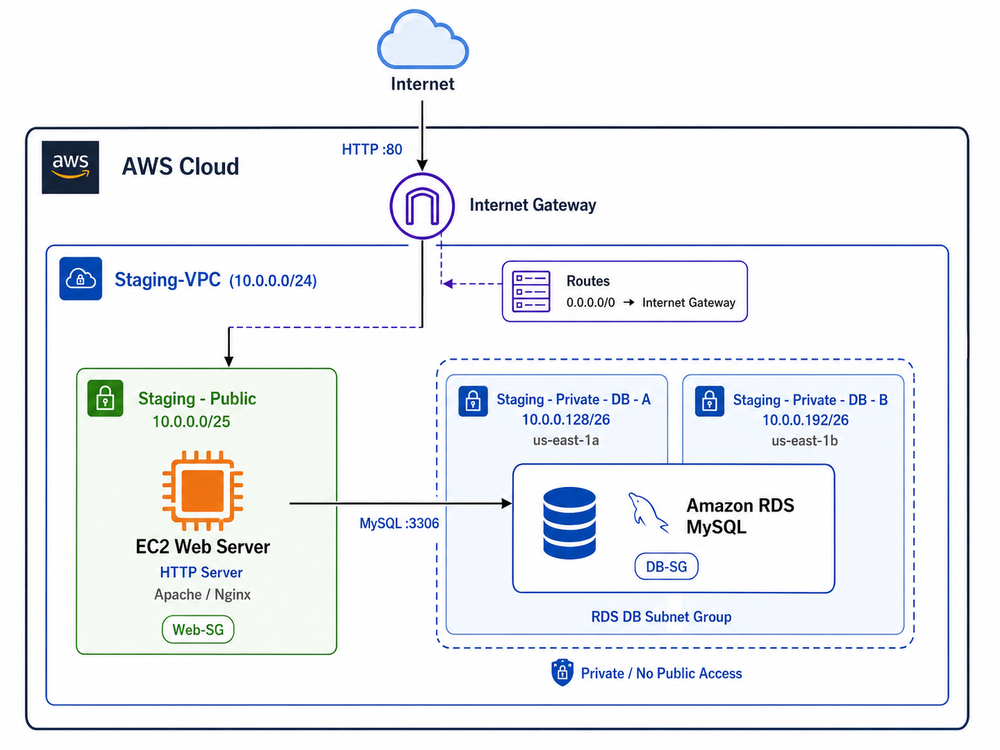

--- 

## Implementation

### 1. VPC and Subnet Configuration

I created a custom VPC named `Staging-VPC` using the CIDR block `10.0.0.0/24` to provide an isolated network for the environment.

Rather than placing every resource in the same subnet, I segmented the VPC into one public subnet for the web tier and two private subnets for the database tier. This separates Internet-facing resources from backend systems and reduces unnecessary exposure.

| Subnet | CIDR | Availability Zone | Purpose |
|---|---|---|---|
| `Staging - Public` | `10.0.0.0/25` | `us-east-1f` | Hosts the public EC2 web server |
| `Staging - Private - DB - A` | `10.0.0.128/26` | `us-east-1a` | Private network space for RDS |
| `Staging - Private - DB - B` | `10.0.0.192/26` | `us-east-1b` | Secondary private subnet for the RDS DB subnet group |

The two database subnets were placed in separate Availability Zones so they could be used together in the RDS DB subnet group and support a more resilient database architecture.

This subnet design creates a clear boundary between the public web tier and the private database tier.

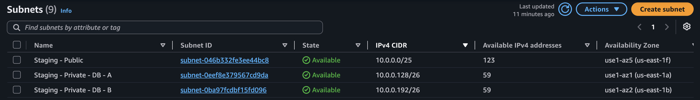

---

### 2. Internet Gateway and Routing

I configured the routing for `Staging-VPC` so that only the public subnet could communicate directly with the Internet.

First, I created an Internet Gateway and attached it to `Staging-VPC`. I then created a dedicated route table and added a default route that sends Internet-bound traffic through the gateway.

```text
10.0.0.0/24  -> local
0.0.0.0/0    -> Internet Gateway
```

The `10.0.0.0/24` local route allows resources inside the VPC to communicate with one another. The `0.0.0.0/0` route provides a path to the Internet through the Internet Gateway.

I associated this route table only with `Staging - Public`, where the EC2 web server is deployed. The private database subnets were intentionally left without a direct Internet Gateway route.

This design allows the web server to receive public HTTP traffic while keeping the database tier isolated from direct Internet access.

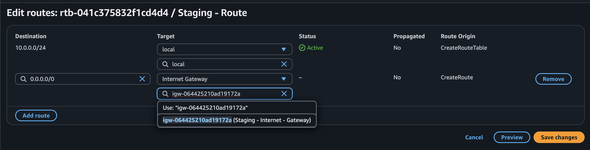

---

### 3. Web Server Security Group

I created a dedicated security group for the public web server so that only the traffic required by the application would be allowed into the instance.

The web server needs to accept HTTP requests from the Internet, so TCP port `80` was opened to `0.0.0.0/0`. SSH access was also enabled for administration, but unlike HTTP, port `22` was restricted to my trusted public IP rather than exposed to the entire Internet.

| Type | Protocol | Port | Source |
|---|---|---:|---|
| HTTP | TCP | 80 | `0.0.0.0/0` |
| SSH | TCP | 22 | Trusted administrator IP |

This configuration allows the web server to remain publicly accessible while reducing unnecessary administrative exposure.

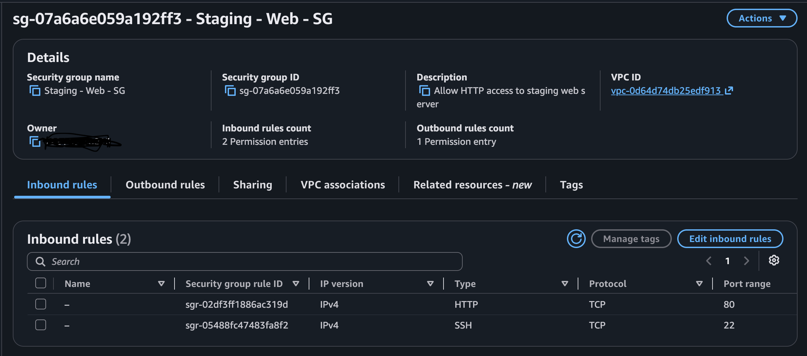

---

### 4. EC2 Web Server Deployment

I deployed an Amazon Linux 2023 EC2 instance named `Staging-Web-Server` inside the public subnet.

The instance was intentionally placed in `Staging - Public` because this subnet has a route to the Internet Gateway. A public IPv4 address was assigned so the server could receive external HTTP traffic, and `Staging - Web - SG` was attached to control which connections were permitted.

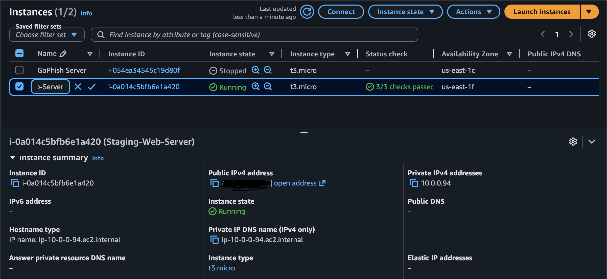

After connecting to the instance over SSH, I installed Apache HTTP Server and configured the service to start automatically when the instance boots.

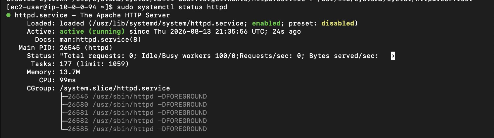

I then accessed the EC2 public IP from an external browser to verify that traffic could successfully travel through the Internet Gateway, public route table, subnet, security group, and finally reach the Apache service.

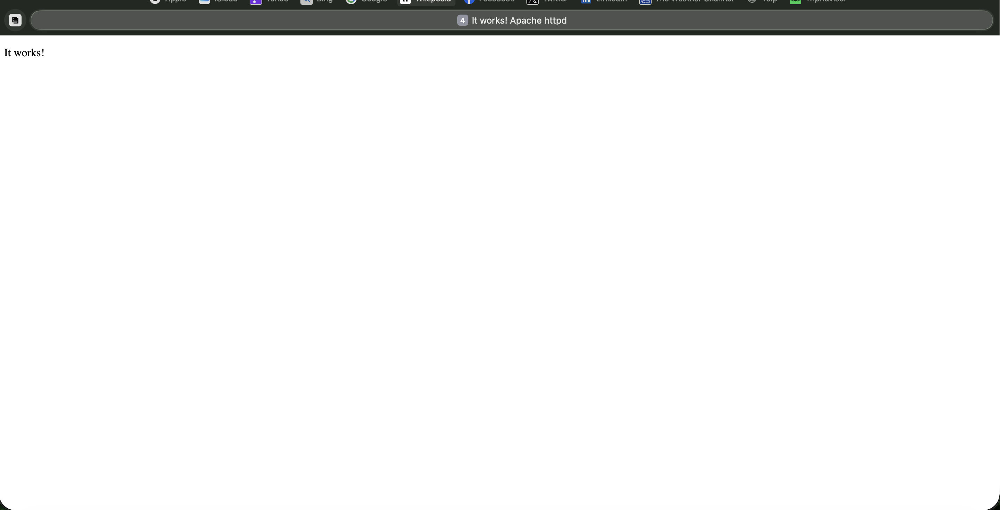

---

### 5. Database Security Group

The database tier required stricter access controls than the public web server.

I created a separate database security group and allowed MySQL traffic on TCP port `3306`. Instead of allowing connections from an IP range such as `0.0.0.0/0`, I configured the source as `Staging - Web - SG`.

| Type | Protocol | Port | Source |
|---|---|---:|---|
| MySQL/Aurora | TCP | 3306 | `Staging - Web - SG` |

Using a security group reference means that database access is based on the role of the source resource rather than its individual IP address. Only resources associated with the web server security group can initiate MySQL connections to the database.

This keeps the database port unavailable to arbitrary Internet hosts while still allowing the application tier to communicate with it.

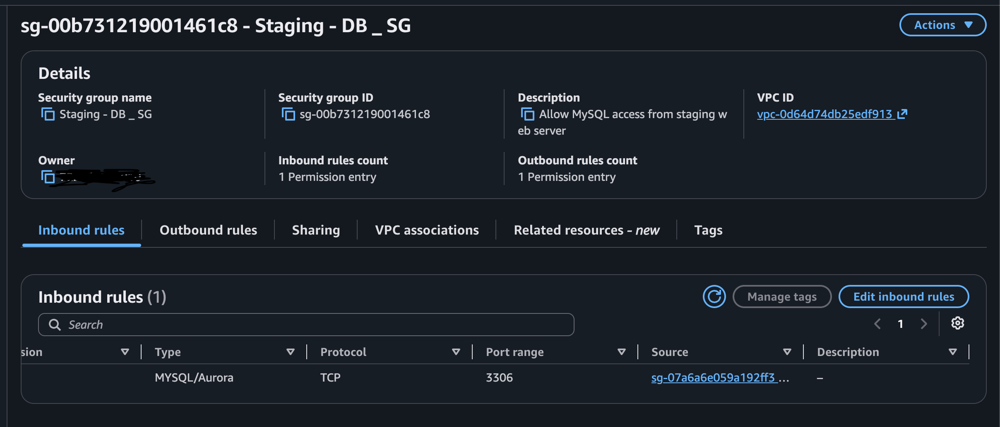

---

### 6. RDS DB Subnet Group

Amazon RDS uses a DB subnet group to determine which subnets are available for database placement.

I created `staging-db-subnet-group` using the two private database subnets that were created earlier in the project.

| Subnet | CIDR | Availability Zone |
|---|---|---|
| `Staging - Private - DB - A` | `10.0.0.128/26` | `us-east-1a` |
| `Staging - Private - DB - B` | `10.0.0.192/26` | `us-east-1b` |

The subnets were intentionally placed in different Availability Zones. This provides RDS with a multi-AZ subnet layout and leaves the architecture ready for higher-availability deployment options if they are needed later.

The public subnet was deliberately excluded so the database tier would remain separated from the Internet-facing portion of the environment.

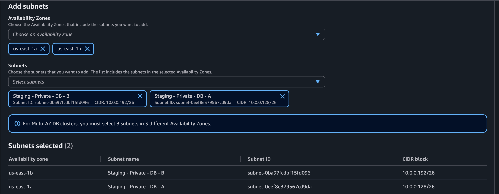

---

### 7. Private RDS MySQL Deployment

I deployed an Amazon RDS MySQL instance named `staging-mysql-db` as the backend database for the environment.

Rather than running MySQL directly on another public-facing EC2 instance, RDS was used as a managed database service. The database was placed inside the private DB subnet group and configured without public accessibility.

| Setting | Configuration |
|---|---|
| Engine | MySQL Community 8.4.10 |
| Instance Class | `db.t4g.micro` |
| Storage | 20 GiB General Purpose SSD |
| Encryption | Enabled |
| Public Access | Disabled |
| Multi-AZ | No |
| DB Subnet Group | `staging-db-subnet-group` |
| Security Group | `Staging - DB _ SG` |
| Port | `3306` |

The database security group allows connections only from the web server security group, while the subnet placement prevents the RDS instance from having a direct public network path.

This creates a clear separation between the Internet-facing web tier and the protected database tier.

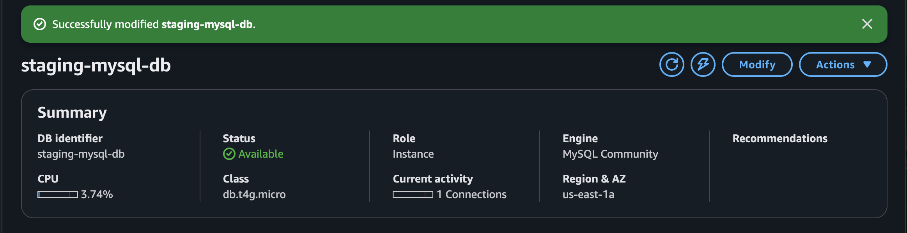

---

### 8. EC2-to-RDS Validation

After both tiers were deployed, I tested whether the security controls still allowed the communication required by the application.

From `Staging-Web-Server`, I connected to the private RDS endpoint over MySQL port `3306`.

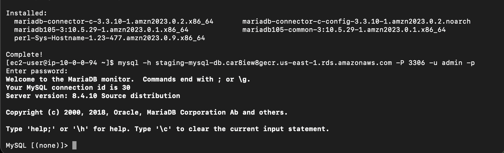

A successful connection alone confirmed network reachability, but I also wanted to verify that the database could perform normal application operations.

I created a test database and table, inserted a record, and queried the stored data:

```sql
CREATE DATABASE staging_app;

USE staging_app;

CREATE TABLE connection_test (
    id INT PRIMARY KEY AUTO_INCREMENT,
    message VARCHAR(100)
);

INSERT INTO connection_test (message)
VALUES ('EC2 successfully connected to private RDS');

SELECT * FROM connection_test;
```
---
### Infrastructure Phase Summary

The main security concepts demonstrated in this phase were VPC design, subnet segmentation, controlled routing, least-privilege security groups, restricted administrative access, private database deployment, encrypted database storage, and end-to-end connectivity validation.

The infrastructure phase is now complete. The next phase will add Amazon CloudWatch monitoring, log collection, alarms, and simulated security and operational events to improve visibility into the environment.

---

