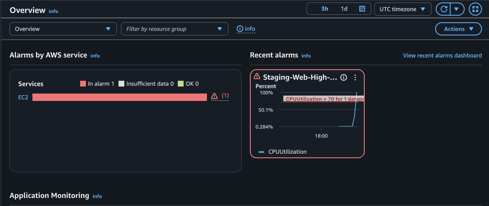
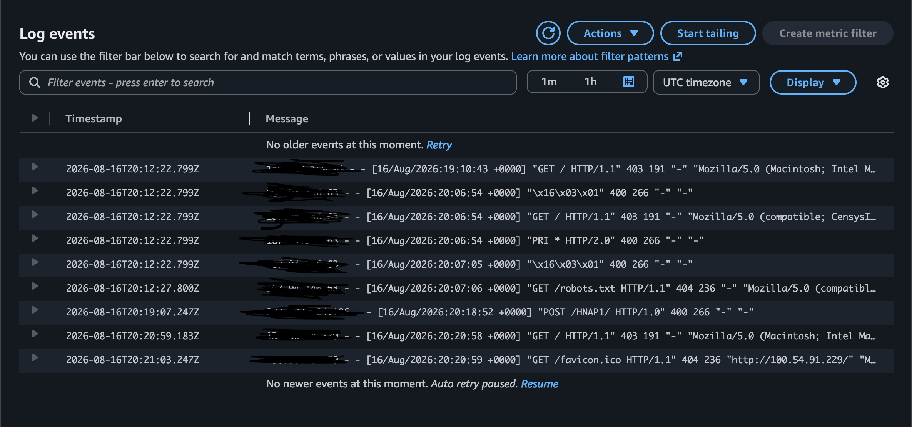
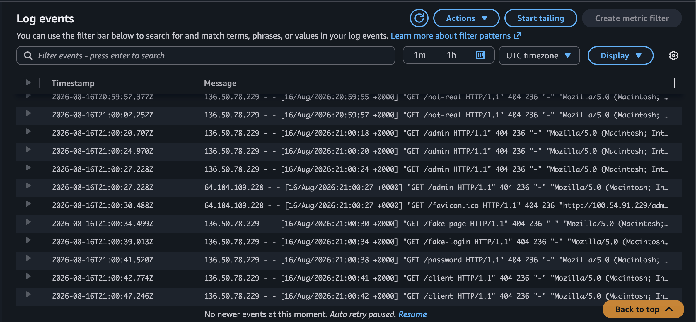
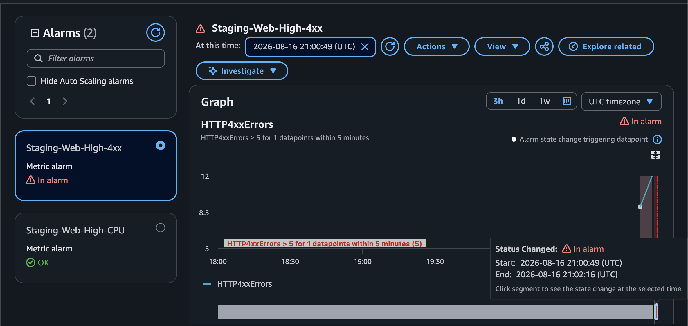
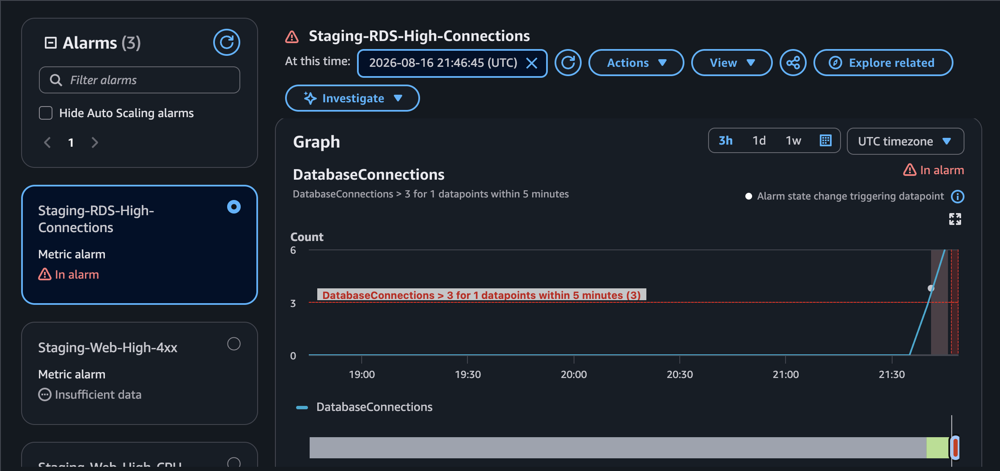

# AWS Secure Web Application Infrastructure Lab

## Overview

This lab demonstrates the deployment and security of a segmented AWS environment using a custom VPC, a public EC2 web server, and a private Amazon RDS MySQL database.

The environment was designed to separate Internet-facing and backend resources using public and private subnets, controlled routing, and least-privilege security groups. The EC2 web server receives HTTP traffic from the Internet, while the RDS database remains isolated in private subnets and accepts MySQL connections only from the EC2 web server layer.

The lab also validates the architecture through external HTTP testing and successful EC2-to-RDS database communication, demonstrating secure connectivity between public and private resources.

## Infrastructure Components

| Component | Configuration | Purpose |
|---|---|---|
| Custom VPC | `Staging-VPC` - `10.0.0.0/24` | Provides an isolated network for the staging environment |
| Public Subnet | `Staging - Public` - `10.0.0.0/25` | Hosts the public-facing EC2 web server |
| Private DB Subnet A | `10.0.0.128/26` - `us-east-1a` | Provides private network space for the database tier |
| Private DB Subnet B | `10.0.0.192/26` - `us-east-1b` | Provides a second private subnet for the RDS subnet group |
| Routing Controls | Public Route Table + Internet Gateway | Allows Internet traffic to the public subnet while keeping the database subnets private |
| Security Groups | Web-SG / DB-SG | Restricts traffic between the Internet, web server, and database |
| EC2 Web Server | Amazon EC2 | Hosts the public HTTP service |
| Private Database | Amazon RDS MySQL | Hosts the database with no direct public Internet access |

## Architecture 

The architecture separates the public-facing web tier from the private database tier. Internet traffic is routed to the EC2 web server through the public subnet, while the RDS database remains isolated within private subnets across separate Availability Zones.


--- 

## Implementation

### 1. VPC and Subnet Configuration

I created a custom VPC named `Staging-VPC` using the CIDR block `10.0.0.0/24` to provide an isolated network for the environment.

Rather than placing every resource in the same subnet, I segmented the VPC into one public subnet for the web tier and two private subnets for the database tier. This separates Internet-facing resources from backend systems and reduces unnecessary exposure.

| Subnet | CIDR | Availability Zone | Purpose |
|---|---|---|---|
| `Staging - Public` | `10.0.0.0/25` | `us-east-1f` | Hosts the public EC2 web server |
| `Staging - Private - DB - A` | `10.0.0.128/26` | `us-east-1a` | Private network space for RDS |
| `Staging - Private - DB - B` | `10.0.0.192/26` | `us-east-1b` | Secondary private subnet for the RDS DB subnet group |

The two database subnets were placed in separate Availability Zones so they could be used together in the RDS DB subnet group and support a more resilient database architecture.

This subnet design creates a clear boundary between the public web tier and the private database tier.


---

### 2. Internet Gateway and Routing

Then I configured the routing for `Staging-VPC` so that only the public subnet could communicate directly with the Internet.

The next step was to create an Internet Gateway and attach it to `Staging-VPC`, then make a dedicated route table and added a default route that sends Internet-bound traffic through the gateway.

```text
10.0.0.0/24  -> local
0.0.0.0/0    -> Internet Gateway
```

The `10.0.0.0/24` local route allows resources inside the VPC to communicate with one another. The `0.0.0.0/0` route provides a path to the Internet through the Internet Gateway.

I associated this route table only with `Staging - Public`, where the EC2 web server is deployed. The private database subnets were intentionally left without a direct Internet Gateway route.

This design allows the web server to receive public HTTP traffic while keeping the database tier isolated from direct Internet access.


---

### 3. Web Server Security Group

For the next phase it involved creating a dedicated security group for the public web server so that only the traffic required by the application would be allowed into the instance.

The web server needs to accept HTTP requests from the Internet, so TCP port `80` was opened to `0.0.0.0/0`. SSH access was also enabled for administration, but unlike HTTP, port `22` was restricted to my trusted public IP rather than exposed to the entire Internet.

| Type | Protocol | Port | Source |
|---|---|---:|---|
| HTTP | TCP | 80 | `0.0.0.0/0` |
| SSH | TCP | 22 | Trusted administrator IP |

This configuration allows the web server to remain publicly accessible while reducing unnecessary administrative exposure.


---

### 4. EC2 Web Server Deployment

I deployed an Amazon Linux 2023 EC2 instance named `Staging-Web-Server` inside the public subnet.

The instance was intentionally placed in `Staging - Public` because this subnet has a route to the Internet Gateway. A public IPv4 address was assigned so the server could receive external HTTP traffic, and `Staging - Web - SG` was attached to control which connections were permitted.


After connecting to the instance over SSH, I installed Apache HTTP Server and configured the service to start automatically when the instance boots.


I then accessed the EC2 public IP from an external browser to verify that traffic could successfully travel through the Internet Gateway, public route table, subnet, security group, and finally reach the Apache service.


---

### 5. Database Security Group

The database tier required stricter access controls than the public web server.

I created a separate database security group and allowed MySQL traffic on TCP port `3306`. Instead of allowing connections from an IP range such as `0.0.0.0/0`, I configured the source as `Staging - Web - SG`.

| Type | Protocol | Port | Source |
|---|---|---:|---|
| MySQL/Aurora | TCP | 3306 | `Staging - Web - SG` |

Using a security group reference means that database access is based on the role of the source resource rather than its individual IP address. Only resources associated with the web server security group can initiate MySQL connections to the database.

This keeps the database port unavailable to arbitrary Internet hosts while still allowing the application tier to communicate with it.


---

### 6. RDS DB Subnet Group

Amazon RDS uses a DB subnet group to determine which subnets are available for database placement.

I then made a `staging-db-subnet-group` using the two private database subnets that were created earlier in the project.

| Subnet | CIDR | Availability Zone |
|---|---|---|
| `Staging - Private - DB - A` | `10.0.0.128/26` | `us-east-1a` |
| `Staging - Private - DB - B` | `10.0.0.192/26` | `us-east-1b` |

The subnets were intentionally placed in different Availability Zones. This provides RDS with a multi-AZ subnet layout and leaves the architecture ready for higher-availability deployment options if they are needed later.

The public subnet was deliberately excluded so the database tier would remain separated from the Internet-facing portion of the environment.


---

### 7. Private RDS MySQL Deployment

The next step was to deploy an Amazon RDS MySQL instance named `staging-mysql-db` as the backend database for the environment.

Rather than running MySQL directly on another public-facing EC2 instance, RDS was used as a managed database service. The database was placed inside the private DB subnet group and configured without public accessibility.

| Setting | Configuration |
|---|---|
| Engine | MySQL Community 8.4.10 |
| Instance Class | `db.t4g.micro` |
| Storage | 20 GiB General Purpose SSD |
| Encryption | Enabled |
| Public Access | Disabled |
| Multi-AZ | No |
| DB Subnet Group | `staging-db-subnet-group` |
| Security Group | `Staging - DB _ SG` |
| Port | `3306` |

The database security group allows connections only from the web server security group, while the subnet placement prevents the RDS instance from having a direct public network path.

This creates a clear separation between the Internet-facing web tier and the protected database tier.


---

### 8. EC2-to-RDS Validation

After both tiers were deployed, I tested whether the security controls still allowed the communication required by the application.

From `Staging-Web-Server`, I connected to the private RDS endpoint over MySQL port `3306`.


A successful connection alone confirmed network reachability, but I also wanted to verify that the database could perform normal application operations.

I created a test database and table, inserted a record, and queried the stored data:

```sql
CREATE DATABASE staging_app;

USE staging_app;

CREATE TABLE connection_test (
    id INT PRIMARY KEY AUTO_INCREMENT,
    message VARCHAR(100)
);

INSERT INTO connection_test (message)
VALUES ('EC2 successfully connected to private RDS');

SELECT * FROM connection_test;
```
---
### Infrastructure Phase Summary

The main security concepts demonstrated in this phase were VPC design, subnet segmentation, controlled routing, least-privilege security groups, restricted administrative access, private database deployment, encrypted database storage, and end-to-end connectivity validation.

The infrastructure phase is now complete. The next phase will be Amazon CloudWatch monitoring, log collection, alarms, and simulated security and operational events to improve visibility into the environment.

---
### 9. CloudWatch Monitoring and Detection

After completing and validating the AWS infrastructure, I added Amazon CloudWatch to improve visibility into the environment and detect abnormal activity on the public EC2 web server.

The goal of this phase was to monitor system performance, centralize Apache web server logs, and create alerts based on both resource usage and suspicious web activity.

#### 9.1 EC2 CPU Monitoring

I created a CloudWatch alarm named `Staging-Web-High-CPU` to monitor CPU utilization on `Staging-Web-Server`.

The alarm was configured to trigger when average CPU utilization exceeded 70% during a 5-minute evaluation period.

To validate the alarm, I intentionally generated CPU load on both vCPUs of the EC2 instance using two `yes` processes. This pushed CPU utilization above the configured threshold.

CloudWatch detected the increase and moved the alarm into the `ALARM` state.

After confirming the alert, I stopped the test processes and verified that CPU usage returned to normal.



This test confirmed that CloudWatch could detect abnormal resource utilization on the EC2 instance and trigger an alert when the configured threshold was exceeded.

---

#### 9.2 Apache Log Collection

I installed the Amazon CloudWatch Agent on `Staging-Web-Server` so Apache logs could be collected and centralized in CloudWatch Logs.

The EC2 instance was assigned an IAM role containing the `CloudWatchAgentServerPolicy`, allowing the CloudWatch Agent to send log data to AWS.

The agent was configured to monitor:

- `/var/log/httpd/access_log`
- `/var/log/httpd/error_log`

The logs were forwarded to:

- `/staging/apache/access`
- `/staging/apache/error`

The CloudWatch Agent was configured to run as the `cwagent` user. During testing, the agent initially could not access the Apache log directory because `/var/log/httpd` was restricted to the root user.

I identified the permissions issue and used Linux ACLs to grant the `cwagent` account only the access required to read the Apache logs instead of broadly opening the directory permissions.

After restarting the CloudWatch Agent, both Apache log groups were successfully created and log events began appearing in CloudWatch.



The centralized logs provided visibility into information such as source IP addresses, HTTP request methods, requested resources, response status codes, and user-agent information.

---

#### 9.3 HTTP 4xx Detection

After confirming that Apache access logs were successfully reaching CloudWatch, I created a metric filter to identify HTTP 4xx responses.

The metric filter searched Apache access logs for client-error status codes including:

- `400 Bad Request`
- `403 Forbidden`
- `404 Not Found`

Each matching log event incremented a custom CloudWatch metric named `HTTP4xxErrors`.

I then created a CloudWatch alarm named `Staging-Web-High-4xx`.

The alarm was configured to trigger when more than five HTTP 4xx responses occurred during a 5-minute period.

To validate the detection, I intentionally requested several nonexistent paths from the Apache web server, including paths such as:

- `/admin`
- `/fake-login`
- `/password`
- `/client`
- `/not-real`

These requests generated repeated `404` responses, which appeared in the Apache access logs and were forwarded to CloudWatch.



The metric filter counted the matching 4xx events and caused the `Staging-Web-High-4xx` alarm to enter the `ALARM` state after the configured threshold was exceeded.



This demonstrated a complete log-based detection workflow:

```text
HTTP Request
     ↓
Apache Web Server
     ↓
Apache Access Log
     ↓
CloudWatch Agent
     ↓
CloudWatch Logs
     ↓
4xx Metric Filter
     ↓
HTTP4xxErrors Metric
     ↓
CloudWatch Alarm
```
#### 9.4 RDS Connection Monitoring

To extend monitoring beyond the public web server, I also monitored the private RDS MySQL database using Amazon CloudWatch.

I selected the `DatabaseConnections` metric for `staging-mysql-db` and created a CloudWatch alarm named `Staging-RDS-High-Connections`.

The alarm was configured to trigger when the number of active database connections exceeded three during a 5-minute evaluation period.

To validate the alarm, I opened multiple simultaneous MySQL sessions from `Staging-Web-Server` to the private RDS database. Each open session created an additional database connection.

As the number of active connections increased, the `DatabaseConnections` metric rose above the configured threshold and caused the CloudWatch alarm to enter the `ALARM` state.



This test confirmed that CloudWatch could monitor database activity and alert when connection volume exceeded the expected threshold.

The monitoring flow was:

```text
Multiple EC2 MySQL Sessions
          ↓
Private RDS MySQL
          ↓
DatabaseConnections Metric
          ↓
Amazon CloudWatch
          ↓
High Connection Alarm
```
## 10. Security Controls Demonstrated

| Security Control | What I Implemented | Why It Matters |
|---|---|---|
| Network Segmentation | Separated the environment into one public subnet and two private database subnets. | Reduces unnecessary exposure by keeping backend resources away from the public Internet. |
| Controlled Internet Routing | Associated the Internet Gateway route only with the public subnet. | Ensures only Internet-facing resources have a direct path to the Internet. |
| Restricted SSH Access | Allowed SSH on port `22` only from a trusted administrator IP. | Reduces the risk of unauthorized remote access and Internet-wide SSH scanning. |
| Web Security Group | Allowed HTTP on port `80` to the public EC2 web server. | Permits required web traffic while limiting inbound access to necessary services. |
| Database Security Group | Allowed MySQL on port `3306` only from `Staging - Web - SG`. | Prevents arbitrary systems from connecting directly to the database and limits access to the approved web tier. |
| Private RDS Deployment | Deployed the MySQL database inside private subnets with public accessibility disabled. | Keeps sensitive backend data from being directly reachable from the Internet. |
| RDS Storage Encryption | Enabled encryption on the RDS database. | Helps protect stored database data if the underlying storage is accessed without authorization. |
| IAM Role for CloudWatch | Assigned the EC2 instance a role with `CloudWatchAgentServerPolicy`. | Allows the CloudWatch Agent to send logs without storing AWS access keys directly on the server. |
| Least-Privilege Log Access | Used Linux ACLs to give the `cwagent` user only the permissions required to read Apache logs. | Avoids running the monitoring agent as root or making sensitive log directories broadly accessible. |
| Centralized Log Collection | Sent Apache access and error logs to CloudWatch Logs. | Makes web activity easier to review, search, and investigate from a central location. |
| High CPU Monitoring | Created an alarm for abnormal EC2 CPU utilization. | Can identify performance problems, runaway processes, or unexpected resource consumption. |
| HTTP 4xx Detection | Created a metric filter and alarm for repeated HTTP `4xx` responses. | Helps identify unusual client activity such as repeated requests to nonexistent or restricted resources. |
| RDS Connection Monitoring | Created an alarm for an unexpected increase in active database connections. | Provides visibility into unusual connection volume that could indicate application problems or unexpected database activity. | 

--- 
## 11. Validation Summary

The environment was tested throughout the project to confirm that both the infrastructure and monitoring controls worked as intended.

Validation included:

- Confirming the Apache web server was reachable over HTTP
- Confirming SSH administrative access to the EC2 instance
- Successfully connecting from EC2 to the private RDS database
- Performing database read and write operations
- Triggering a high CPU CloudWatch alarm
- Forwarding Apache access and error logs to CloudWatch Logs
- Generating repeated HTTP 404 responses and triggering a 4xx alarm
- Generating multiple simultaneous RDS connections and triggering a database connection alarm

These tests confirmed that required communication remained functional while CloudWatch provided visibility into abnormal activity.

---

## 12. Key Takeaways

This project demonstrated how to build a segmented AWS environment with security and monitoring built into the architecture.

The public web server was separated from the private database tier, and communication between resources was limited to what was actually required. CloudWatch was then used to monitor EC2 performance, centralize Apache logs, detect repeated HTTP errors, and monitor RDS connection activity.

The lab also reinforced the importance of validating security controls instead of only configuring them. Each major control was tested to confirm that normal communication still worked while unusual activity could be detected.
