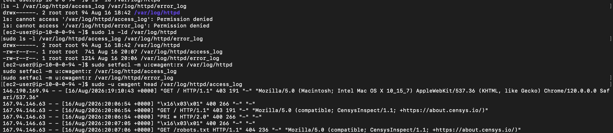
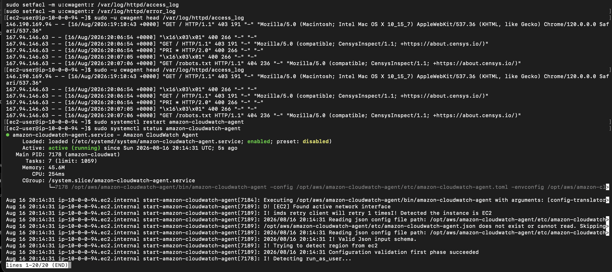

## Troubleshooting

### CloudWatch Agent Could Not Read Apache Logs

While configuring the CloudWatch Agent to collect Apache access and error logs, the agent was installed, configured, and running, but the expected CloudWatch log groups were not appearing.

Because the EC2 instance already had the correct IAM role attached, I tested whether the `cwagent` service account could access the Apache log files directly.

```bash
sudo -u cwagent head /var/log/httpd/access_log
```

The command returned `Permission denied`, which showed that the issue was related to local Linux file permissions rather than AWS IAM permissions.

I then inspected the Apache log directory and file permissions:

```bash
sudo ls -ld /var/log/httpd
sudo ls -l /var/log/httpd/access_log /var/log/httpd/error_log
```

The results showed:

```text
/var/log/httpd
drwx------ root root

/var/log/httpd/access_log
-rw-r--r-- root root

/var/log/httpd/error_log
-rw-r--r-- root root
```

Although the individual log files had read permissions, the `/var/log/httpd` directory was restricted to the `root` user. Because the `cwagent` service account could not traverse the directory, it could not reach the Apache log files.



### Resolution

Instead of making the Apache log directory broadly accessible or running the CloudWatch Agent as `root`, I used Linux Access Control Lists (ACLs) to give the `cwagent` account only the permissions required to access the logs.

```bash
sudo setfacl -m u:cwagent:rx /var/log/httpd
sudo setfacl -m u:cwagent:r /var/log/httpd/access_log
sudo setfacl -m u:cwagent:r /var/log/httpd/error_log
```

I then tested the permissions again:

```bash
sudo -u cwagent head /var/log/httpd/access_log
```

This time, Apache access-log entries were successfully returned, confirming that the `cwagent` account could read the log files.



I then restarted the CloudWatch Agent:

```bash
sudo systemctl restart amazon-cloudwatch-agent
```

and verified that the service was running:

```bash
sudo systemctl status amazon-cloudwatch-agent
```

The service returned:

```text
Active: active (running)
```

After resolving the permissions issue, the following CloudWatch log groups were successfully created:

```text
/staging/apache/access
/staging/apache/error
```

Apache access and error events then began appearing in CloudWatch Logs as expected.

### Root Cause

The CloudWatch Agent had the AWS IAM permissions required to publish logs to CloudWatch, but the local `cwagent` service account did not have permission to traverse the `/var/log/httpd` directory.

The issue was therefore occurring at the operating-system permissions layer rather than the AWS IAM layer.

### What I Learned

This troubleshooting process reinforced that cloud log collection depends on multiple layers of access control.

The IAM role determines whether the EC2 instance is allowed to send data to CloudWatch, while Linux filesystem permissions determine whether the CloudWatch Agent can read the source log files.

Using ACLs allowed me to solve the problem using least privilege instead of making the Apache directory broadly accessible or running the monitoring agent with unnecessary root permissions.
